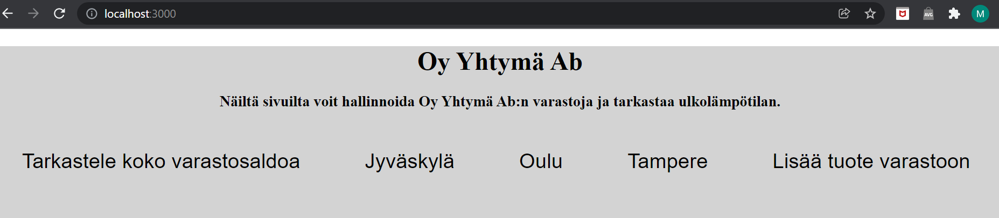

# XAMK palvelinohjelmointi

16.6.2019
Matti Leppäkorpi 20h.
Tein palvelimen jonne voi lisätä kolmessa eri kaupungissa toimivan 
Oy Yhtymä Ab:n varastosaldolle uusia asioita ja hakea varastosaldot, sekä poistaa asioita varastosalolta.
Tämän lisäksi sivustolta näkee kaupunkikohtaisen viimeisimmän lämpötilan.

Tein aluksi etusivun html-muotoon, mutta muutin sen pugiksi netistä löytyneen kääntäjän avulla. Css-
tiedoston kanssa meinasi olla ongelmia kunnes sain siihen apua ja lisäsin routes.js tiedostoon 
router.use('/static', express.static(path.join(__dirname, '..', 'static'))); 

Taidot loppuivat siihen kun yritin keksiä miten location-tiedon voisi antaa valmiista vaihtoehdoista 
käyttäjälle <select>-tagilla. Tämän avulla olisin ehkä voinut keksiä konstin myös varastojen sorttaamisen
kaupungeittain. Nyt tuo kaupunkikohtainen varastosaldo näyttää koko varaston.

